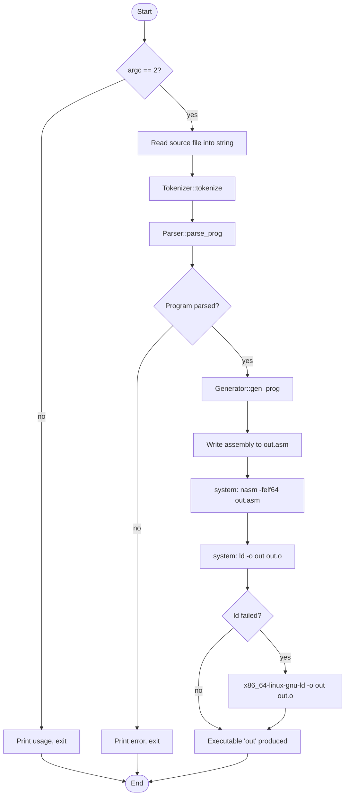
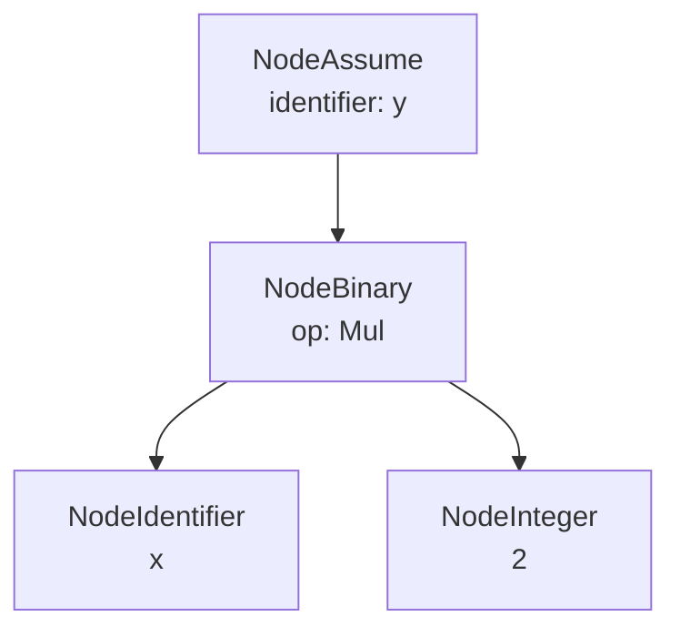
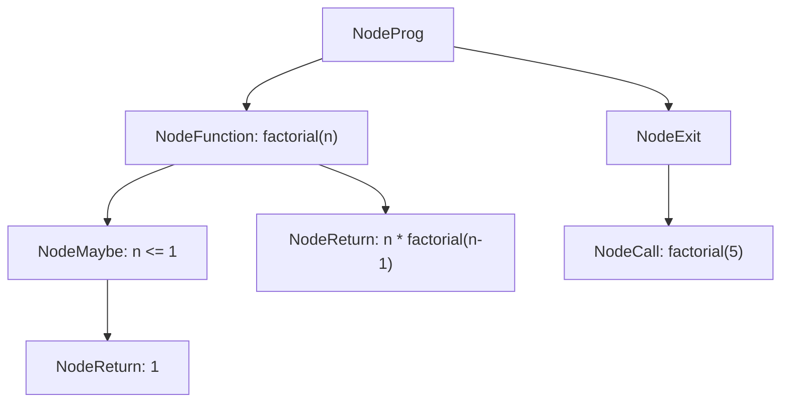
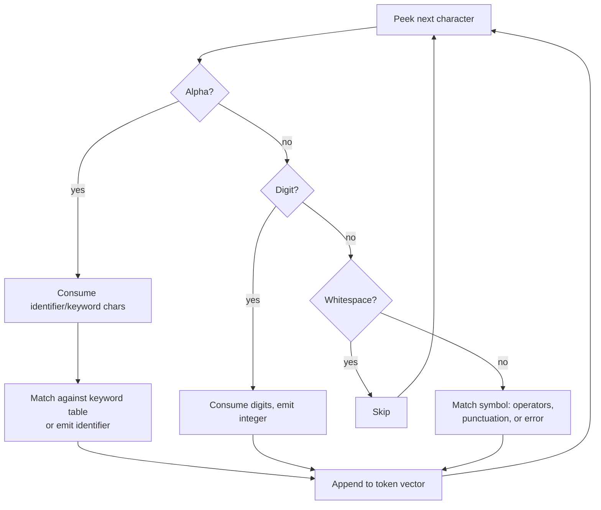
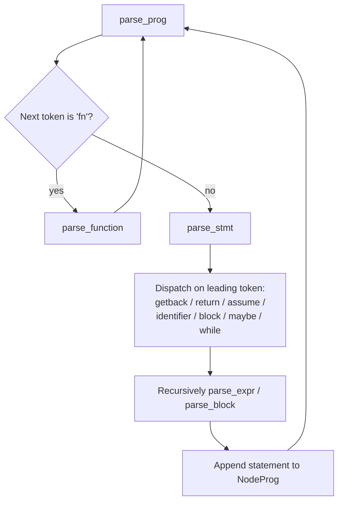
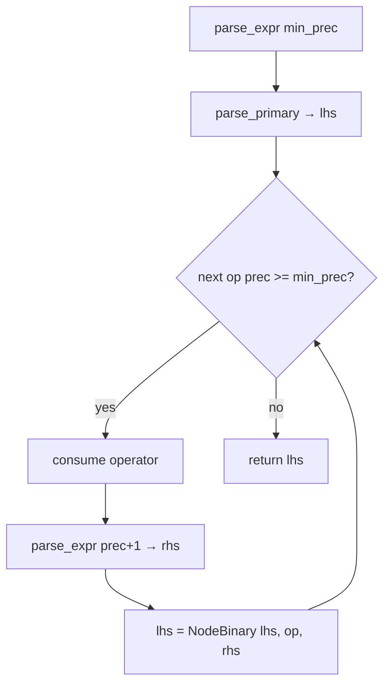
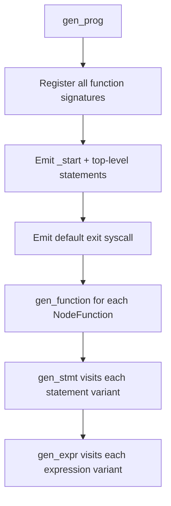
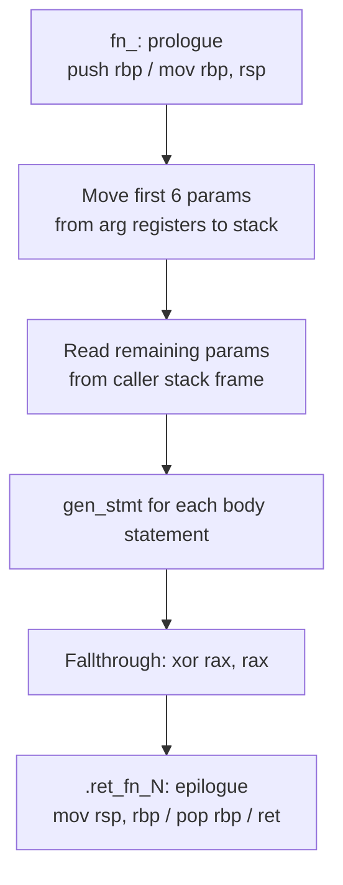
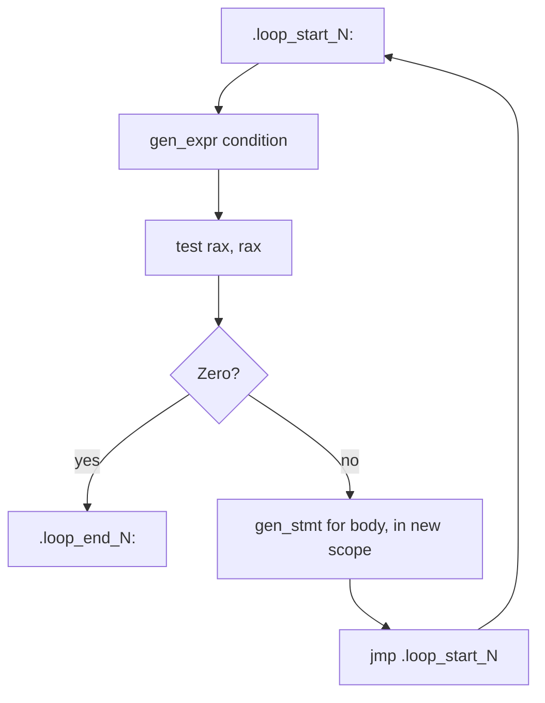
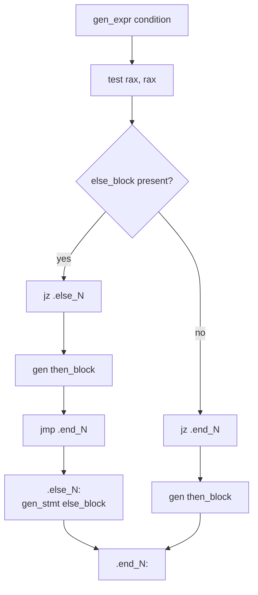

# Kompy Compiler

## 1. Introduction

**Kompy** is a from-scratch compiler, written in c++20, that translates a small imperative language into x86-64 Linux assembly, links it into a native ELF execulable, and runs directly on the CPU (no interpreter, no bytecode, no external backend such as LLVM).

**Objectives of this project**, as reflected in the implementation, are to explore the core stages of a compiler pipeline by hand: hand-written lexing, recursive-descent/precedence climbing parsing, AST construction, and direct assembly emission.

**Compiler overview:** a `.ko` source file is read into memory, tokenized, parsed into an Abstract Syntax Tree (`NodeProg`), and walked by a stack machine code generator that emits NASM-syntax x86-64 assembly. The assembly is assembled with `nasm` and linked with `ld` into a standalone executable.

**Key features implemented:**

- Integer literals and arithmetic (`+ - * / %`)
- Comparison (`== != > < <= >=`) and logical (`&& || !`) operators, with correct precedence
- Unary negation and logical NOT
- Variable declaration (`assume`) and reassignment
- Block scoped variables (nested `{ }` scopes)
- Conditional statements (`maybe` / `otherwise`, including `otherwise maybe` chains)
- `while` loops
- Function definitions with parameters, function calls (as expression or statements), and `return`
- Program termination via `getback(expr)`, which exits the process with `expr` as the exit code
  
---

## 2. Project Structure

```text
Compy/
├── src/
│   ├── tokenization.hpp   # Lexer: TokenType enum, Token struct, Tokenizer class
│   ├── parser.hpp         # AST node definitions + Parser class (recursive-descent)
│   ├── generation.hpp     # Generator class: AST -> NASM x86-64 assembly
│   └── main.cpp           # Driver: reads file, runs the pipeline, invokes nasm/ld
├── CMakeLists.txt         # CMake build definition (C++20, single executable "kompy")
├── Makefile               # Convenience wrapper around cmake (build / run / clean)
├── test.ko                # Sample Kompy source (recursive factorial)
├── Readme.md              # Project README
└── .gitignore
```

| File | Responsibility |
|---|---|
| `tokenization.hpp` | Converts raw source text into a `std::vector<Token>`. |
| `parser.hpp` | Defines every AST node type and the `Parser` that builds a `NodeProg` from tokens. |
| `generation.hpp` | Defines the `Generator`, which walks the AST and emits assembly text. |
| `main.cpp` | Orchestrates tokenizer → parser → generator, writes `out.asm`, and shells out to `nasm` and `ld`. |

Kompy has no separate semantic-analysis or optimization pass; type/scope checks (e.g. undefined variable, duplicate declaration, calling a non-function) are performed inline inside the code generator.

---

## 3. Language Specification

### Keywords
`getback`, `assume`, `maybe`, `otherwise`, `while`, `fn`, `return`

### Identifiers

An indentifier starts with an alphabetic character and may continue with letters, digits, or underscores.

### Data types

Kompy has a single implicit data type: a 64-bit integer. There is no type annotation syntax and no other primitive type (no floats, strings, booleans or arrays). Comparison and logical expressions produce `0`/`1` integers.

### Variable declaration
```ko
assume x = 10;
```
### Assignment (existing variable)
```ko
x = x + 1;
```

### Arithmetic operators
```ko
a + b   a - b   a * b   a / b   a % b
```

### Comparison operators
```ko
a == b   a != b   a < b   a > b   a <= b   a >= b
```

### Logical operators
```ko
a && b   a || b   !a
```

### If / Else (`maybe` / `otherwise`)
```ko
maybe (x > 0) {
    getback(1);
} otherwise maybe (x < 0) {
    getback(2);
} otherwise {
    getback(0);
}
```

### While loops
```ko
assume i = 0;
while (i < 5) {
    i = i + 1;
}
```

### Functions
```ko
fn add(a, b) {
    return(a + b);
}
```

### Return statements
```ko
return(a + b);
```
`return` is only valid inside a function body.

### Function calls
Calls may appear as a standalone statement or inside an expression:
```ko
add(2, 3);
assume total = add(2, 3) * 2;
```

### Expressions

Expressions combine integers, identifiers, function calls, unary `-` / `!`, parenthesised sub-expressions, and the binary operators above, with standard precedence (see Section 4).

### Program exit (`getback`)
```ko
getback(a + b);
```
`getback(expr)` terminates the whole process immediately, using `expr` as the exit status. It is the only way a Kompy program ends normally.

---

## 4. Language Grammar

Derived directly from `parser.hpp`:

```ebnf
Program        ::= (FunctionDecl | Statement)*

FunctionDecl   ::= "fn" identifier "(" ParamList? ")" Block
ParamList      ::= identifier ("," identifier)*

Block          ::= "{" Statement* "}"

Statement      ::= ExitStmt
                 | ReturnStmt
                 | AssumeStmt
                 | AssignStmt
                 | CallStmt
                 | Block
                 | MaybeStmt
                 | WhileStmt

ExitStmt       ::= "getback" "(" Expression ")" ";"
ReturnStmt     ::= "return" "(" Expression ")" ";"
AssumeStmt     ::= "assume" identifier "=" Expression ";"
AssignStmt     ::= identifier "=" Expression ";"
CallStmt       ::= identifier "(" ArgList? ")" ";"

MaybeStmt      ::= "maybe" "(" Expression ")" Block
                    ( "otherwise" ( MaybeStmt | Block ) )?

WhileStmt      ::= "while" "(" Expression ")" Block

ArgList        ::= Expression ("," Expression)*

Expression     ::= Expression BinOp Expression
                 | UnaryExpr

BinOp          ::= "||" | "&&"
                 | "==" | "!="
                 | "<" | ">" | "<=" | ">="
                 | "+" | "-"
                 | "*" | "/" | "%"

UnaryExpr      ::= ("!" | "-") UnaryExpr
                 | Primary

Primary        ::= integer
                 | Call
                 | identifier
                 | "(" Expression ")"

Call           ::= identifier "(" ArgList? ")"
```

`Expression` is not parsed as separate grammar levels; the parser uses **precedence climbing** with the following binding power table (`Parser::bin_prec`):

| Operators | Precedence |
|---|---|
| `\|\|` | 1 (lowest) |
| `&&` | 2 |
| `==`, `!=` | 3 |
| `<`, `>`, `<=`, `>=` | 4 |
| `+`, `-` | 5 |
| `*`, `/`, `%` | 6 (highest) |

Unary `!` and unary `-` bind tighter than any binary operator, since they are handled inside `parse_primary()`.

---

## 5. Compiler Architecture

Kompy has four core components, each a distinct class or translation unit, invoked in sequence by `main.cpp`.

```mermaid
flowchart LR
    A[.ko Source File] --> B[Tokenizer]
    B --> C[Parser]
    C --> D[AST NodeProg]
    D --> E[Generator]
    E --> F[out.asm (NASM x86-64)]
    F --> G[nasm]
    G --> H[out.o]
    H --> I[ld]
    I --> J[out (ELF executable)]
```

- **Tokenizer** (`tokenization.hpp`) - hand-written character scanner producing a flat token stream.
- **Parser** (`parser.hpp`) - recursive descent parser with precedence climbing for expressions; produces a `NodeProg` containing top level statements and function declarations.
- **AST** (`parser.hpp`) - a set of `std::variant` based node structs (Section 7).
- **Generator** (`generation.hpp`) - a single pass, stack machine code generator that emits textual x86-64 assembly directly from the AST, with no intermediate representation or optimiation pass.

---

## 6. Compilation Pipeline

`main.cpp` drives the entire pipeline for one input file:



`nasm` and `ld` are invoked via `system()` calls at the end of `main()`; Kompy does not link against `libc` or use a C runtime: the generated binary starts at `_start` and exits via the raw `exit` syscall.

---

## 7. Abstract Syntax Tree

All AST nodes live in `parser.hpp`. Expression nodes are stored in `NodeExpr::var` (a `std::variant`); statement nodes in `NodeStmt::var`.

### Expression nodes

| Node | Purpose | Main fields |
|---|---|---|
| `NodeInteger` | Integer literal | `integer` (Token) |
| `NodeIdentifier` | Variable reference | `identifier` (Token) |
| `NodeBinary` | Binary operation | `op` (`BinOp`), `left`, `right` (`shared_ptr<NodeExpr>`) |
| `NodeUnary` | Unary operation (`-`, `!`) | `op` (`UnaryOp`), `operand` |
| `NodeCall` | Function call (as an expression) | `identifier`, `args` (vector of expr pointers) |

### Statement nodes

| Node | Purpose | Main fields |
|---|---|---|
| `NodeExit` | `getback(expr)` - process exit | `expr` |
| `NodeAssume` | `assume x = expr;` - declaration | `identifier`, `expr` |
| `NodeAssign` | `x = expr;` - reassignment | `identifier`, `expr` |
| `NodeBlock` | `{ ... }` - a scoped list of statements | `stmts` |
| `NodeMaybe` | `maybe`/`otherwise` conditional | `condn`, `then_block`, optional `else_block` |
| `NodeWhile` | `while` loop | `condn`, `body` |
| `NodeReturn` | `return(expr);` | `expr` |
| `NodeCallStmt` | A call used as a statement | `call` (`NodeCall`) |

### Program-level nodes

- `NodeFunction { name, params, body }`: one function definition.
- `NodeProg { stmts, functions }`: the whole program: top-level statements plus all function declarations.

### Example AST (for `assume y = x * 2;`)



---

## 8. Code Generation

`Generator` (`generation.hpp`) walks the AST once and emits NASM assembly text. It has **no register allocator**, every expression result is pushed to and popped from the runtime stack, and local variables live entirely on the stack, addressed as `QWORD [rsp + offset]` relative to the current stack depth (`m_stack_size`). Scopes are tracked as a `std::vector` of name→stack-offset maps (`m_scopes`), pushed/popped by `begin_scope()` / `end_scope()`.

**Variables**: `assume` evaluates the initializer (leaving the value on the stack) and records the new variable's stack slot; `NodeIdentifier` looks the name up from the innermost scope outward and re-reads it from its stack slot.

**Arithmetic**: operands are generated left, then right, popped into `rbx`/`rax`, and combined:
```asm
add rax, rbx      ; +
sub rax, rbx      ; -
imul rax, rbx     ; *
cqo
idiv rbx          ; / (quotient in rax)
```

**Comparisons**: use `cmp` + `setX`/`movzx` to produce a 0/1 integer, e.g.:
```asm
cmp rax, rbx
setl al
movzx rax, al     ; a < b
```

**Logical `&&` / `||`**: are implemented with `test`/`sete` on both operands followed by `and`/`or` on the low byte (not short-circuiting).

**If statements (`maybe`)**: evaluate the condition, `test`/`jz` past the `then` block to an `.else_N` or `.end_N` label; `otherwise` bodies are emitted after the jump-over.

**While loops**: emit a `.loop_start_N` label, re-evaluate the condition each iteration, and `jz` to `.loop_end_N` when false.

**Functions**: each function becomes a `fn_<name>:` label with a standard prologue (`push rbp` / `mov rbp, rsp`). The first six parameters are moved from the System V argument registers (`rdi, rsi, rdx, rcx, r8, r9`) onto the stack as local variables; further parameters are read from the caller's stack frame. Every function has one shared return label (`.ret_fn_N`) that restores `rsp`/`rbp` and executes `ret`.

**Function calls**: evaluate argument expressions, pop them into the appropriate argument registers, and `call fn_<name>`; the callee's return value in `rax` is pushed onto the caller's expression stack.

**Return statements**: evaluate the return expression into `rax` and `jmp` directly to the enclosing function's return label, correctly unwinding through nested blocks/conditionals.

**`getback` (program exit)**: is distinct from `return`: it evaluates its expression and issues the exit syscall directly (`mov rax, 60` / `pop rdi` / `syscall`), terminating the process regardless of whether it appears inside a function.

---

## 9. Example Compilation

**Source (`example.ko`):**
```ko
fn factorial(n) {
    maybe (n <= 1) {
        return(1);
    }
    return(n * factorial(n - 1));
}

getback(factorial(5));
```

**AST (simplified):**


**Generated assembly (excerpt of `out.asm`):**
```asm
global _start
section .text
_start:
    mov rax, 5
    push rax
    pop rdi
    call fn_factorial
    push rax
    mov rax, 60
    pop rdi
    syscall
    mov rax, 60
    xor rdi, rdi
    syscall
fn_factorial:
    push rbp
    mov rbp, rsp
    push rdi
    push QWORD [rsp + 0]
    mov rax, 1
    push rax
    pop rbx
    pop rax
    cmp rax, rbx
    setle al
    movzx rax, al
    push rax
    pop rax
    test rax, rax
    jz .end_1
    mov rax, 1
    push rax
    pop rax
    jmp .ret_fn_0
.end_1:
    ...
.ret_fn_0:
    mov rsp, rbp
    pop rbp
    ret
```

**Final executable:** assembling and linking this output and running `./out` followed by `echo $?` prints:
```text
120
```
(`5! = 120`, returned as the process exit code — verified against the actual generated binary.)

---

## 10. Visual Flowcharts

**Lexer workflow**


**Parser workflow**


**Expression parsing (precedence climbing)**


**Code generation dispatch**


**Function compilation**


**While loop compilation**


**If statement compilation**


---

## 11. Building and Running

**Build:**
```bash
cmake -B build
cmake --build build
```
`cmake -B build` generates the build system in `build/`; `cmake --build build` compiles `src/main.cpp` (C++20) into the `kompy` executable, as defined in `CMakeLists.txt`.

**Compile a Kompy source file:**
```bash
./build/kompy example.ko
```
This runs the tokenizer → parser → generator pipeline, writes `out.asm`, assembles it with `nasm -felf64 out.asm` to produce `out.o`, and links it with `ld -o out out.o` (falling back to `x86_64-linux-gnu-ld` if `ld` fails) to produce the executable `out`.

**Run the compiled program:**
```bash
./out
echo $?
```
The exit code is the value passed to `getback(...)`.

**Convenience via `Makefile`:**
```bash
make build            # cmake -B build && cmake --build build
make run FILE=example.ko   # ./build/kompy example.ko
make clean             # removes build/, out, out.asm, out.o
```

---
